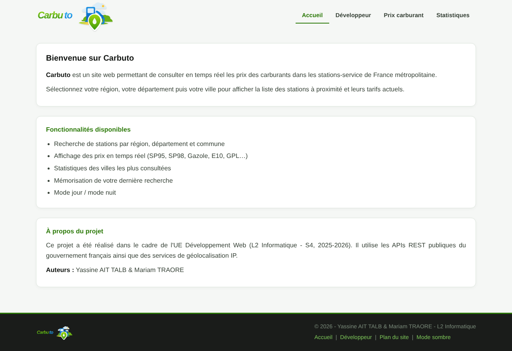
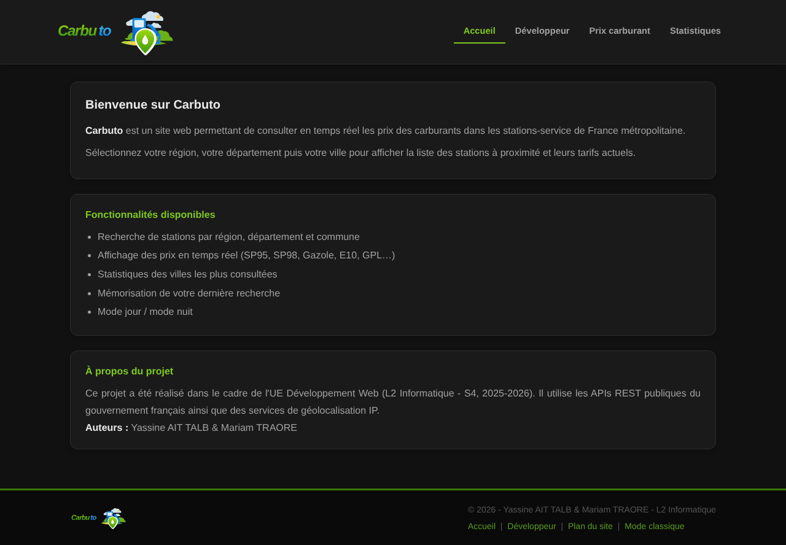
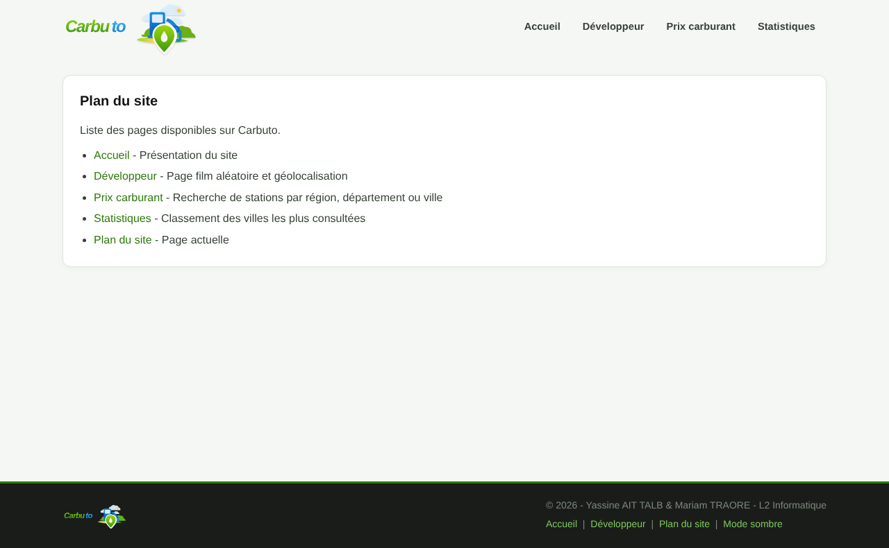
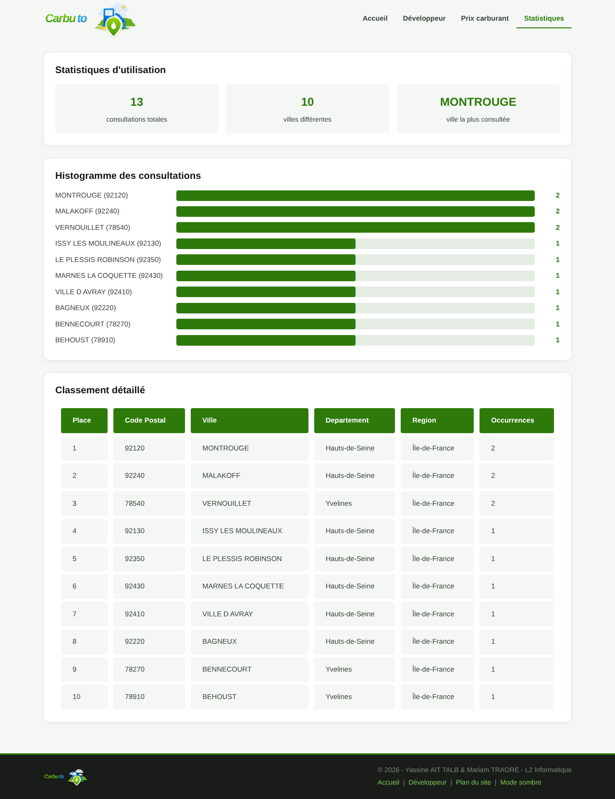
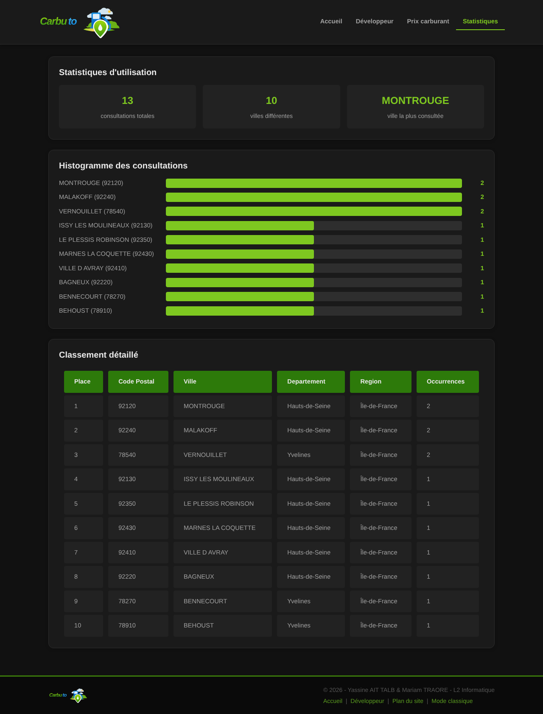
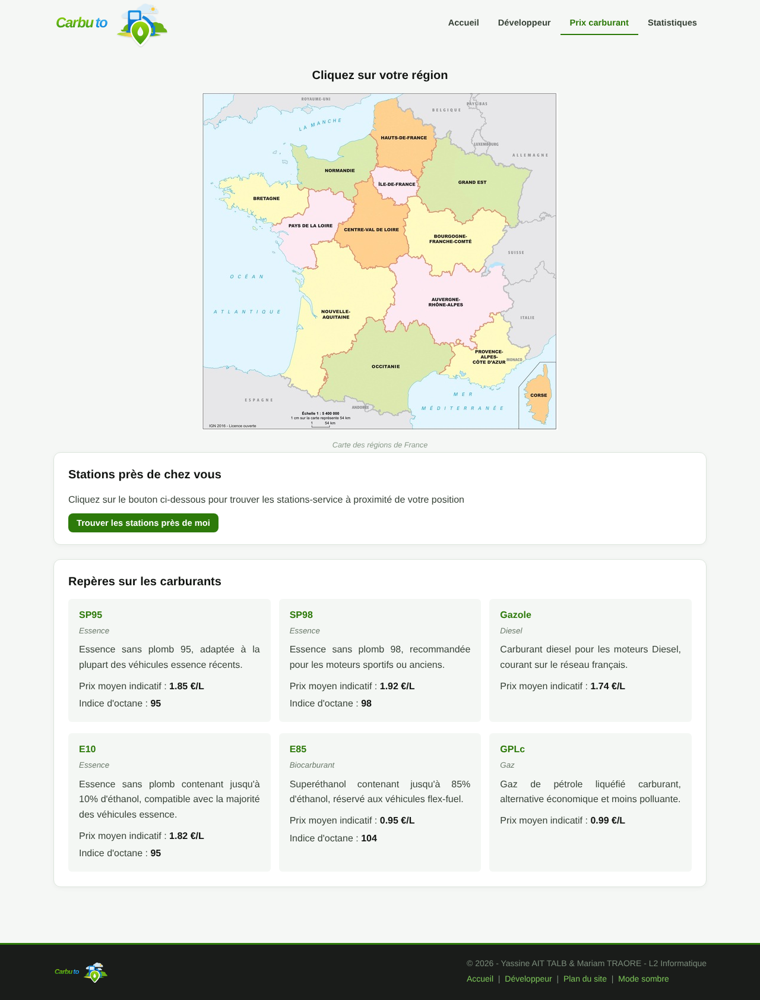
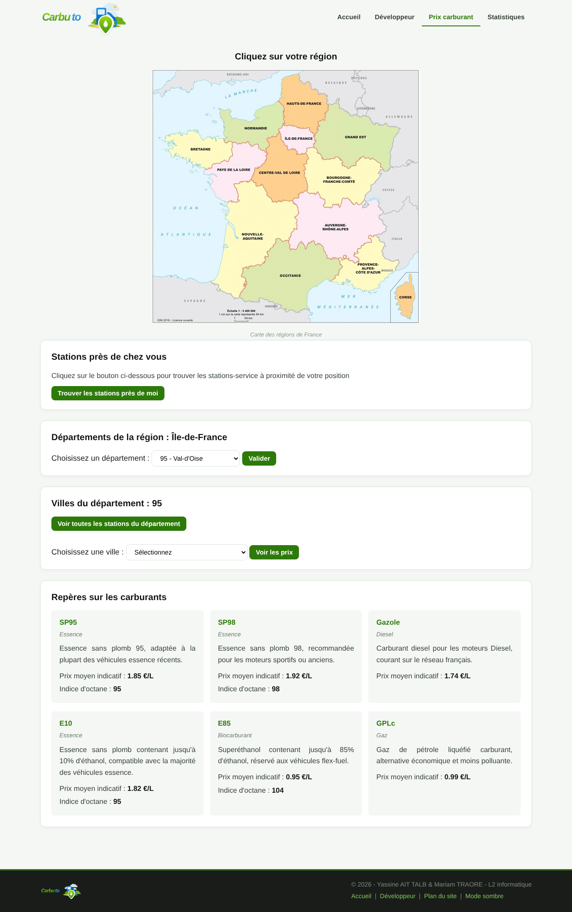

# Carbuto

Site web en PHP qui permet de consulter les prix des carburants dans les stations-service de France métropolitaine. On choisit une région sur une carte, puis un département et une ville, et le site affiche les stations avec leurs prix. Il y a aussi une page de statistiques sur les villes les plus consultées, un plan du site et une page « Développeur » (film aléatoire et géolocalisation par adresse IP).

Projet réalisé en L2 Informatique (S4, 2025-2026), dans l'UE Développement Web, à deux avec Mariam Traore.

## Technos

- PHP, HTML, CSS (deux thèmes : classique et sombre)
- Cookies pour le thème et la dernière recherche
- Fichiers CSV (villes, départements, régions, historique des consultations) et un fichier XML (infos sur les carburants)
- API des prix des carburants (data.economie.gouv.fr)
- API Ghibli (film aléatoire), avec `ressources/films.json` en secours
- API REST IP2Location (géolocalisation par adresse IP)
- Doxygen pour la documentation du code (`Doxyfile`, dossier `doc/`)

Il n'y a pas de base de données à importer : tout est stocké dans les fichiers du dossier `ressources/`.

## Lancer le projet

Il faut PHP (avec `allow_url_fopen` activé) et l'extension XML.

1. Copier `.env.example` en `.env` et mettre sa clé IP2Location dans `IP2LOCATION_KEY`. Sans clé, le site marche mais la géolocalisation est désactivée.
2. Lancer le serveur depuis la racine du projet :

```
php -S localhost:8000
```

3. Ouvrir http://localhost:8000/index.php

Le fichier `ressources/historique.csv` (consultations des villes) est créé tout seul à la première recherche d'une ville, le dossier `ressources/` doit donc être accessible en écriture. Il n'est pas publié dans le dépôt.

## Captures d'écran

Accueil (thème classique et thème sombre) :





Plan du site :



Statistiques des consultations (diagramme en barres et classement) :





Prix des carburants (carte des régions) :



Choix du département et de la ville :



## Ce que j'ai fait

- la page d'accueil
- la page « Développeur » : film aléatoire
- le plan du site
- le diagramme des statistiques de visites
- la géolocalisation des visiteurs par adresse IP avec l'API REST IP2Location

Mariam Traore a fait le reste.

Le dossier `rapport/` contient le rapport du projet (`rapport.pdf`).
